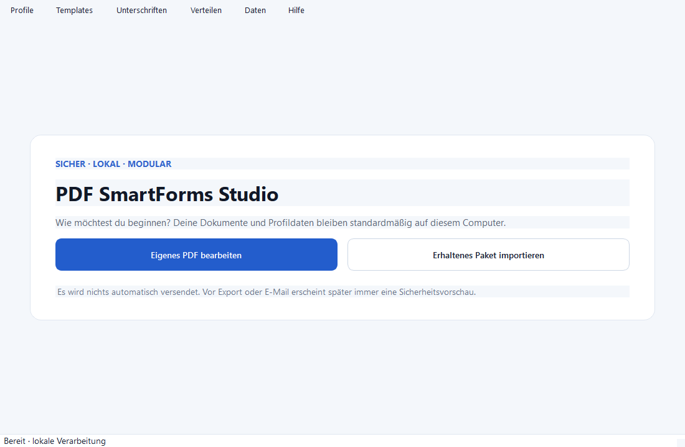

# Benutzerhandbuch

PDF SmartForms Studio hilft dabei, PDF-Formulare lokal zu analysieren,
auszufüllen, mit sichtbaren Bildunterschriften zu versehen und kontrolliert
weiterzugeben. Die Anwendung versendet nichts automatisch.

## Schnellnavigation

1. [Installation](installation.md)
2. [Erster Start und eigenes PDF](quickstart.md)
3. [Profile](profiles.md)
4. [PDF-Analyse und Felder](pdf-analysis.md)
5. [Templates](templates.md)
6. [Unterschriften](signatures.md)
7. [Speichern, Drucken und E-Mail](distribution.md)
8. [Datensicherung](backup.md)
9. [Datenschutz und Sicherheit](privacy-and-security.md)

## Grundregeln

- Grün/✓ bedeutet zugeordnet, Gelb/⚠ muss geprüft werden und Rot/✕ ist offen.
- Automatisch erkannte Inhalte sind Vorschläge.
- Eine Bildunterschrift ist keine qualifizierte elektronische Signatur.
- Vor Speichern, Drucken oder E-Mail erscheint eine Sicherheitsvorschau.
- Profile, Signaturen und Dokumente bleiben standardmäßig auf dem Computer.

