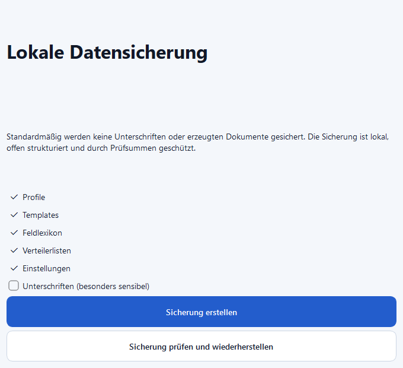

# Datensicherung und Wiederherstellung

Die Verwaltung ist über **Daten → Datensicherung und Wiederherstellung** oder
`Strg+Shift+B` erreichbar.

## Sicherung erstellen

Standardmäßig enthalten sind Profile, Templates, Feldlexikon,
Verteilerlisten und Einstellungen. Unterschriften sind abgewählt.

Das `.psfsbackup`-Paket enthält:

- ein versioniertes Manifest
- die ausgewählten lokalen Daten
- SHA-256-Prüfsummen für jede Datei

Backups mit Unterschriften sind in Version 1.0 noch nicht verschlüsselt. Die
Anwendung warnt deshalb deutlich. Solche Sicherungen nur an einem geschützten
Ort speichern.

## Wiederherstellen

1. Sicherung auswählen.
2. Integritätsprüfung abwarten.
3. Version, Bereiche, Dateien und Konflikte prüfen.
4. Wiederherstellung bestätigen.

Vorher entsteht automatisch ein Sicherungspunkt. Bestehende Dateien werden
nicht still überschrieben; zunächst werden nur fehlende Dateien ergänzt.
