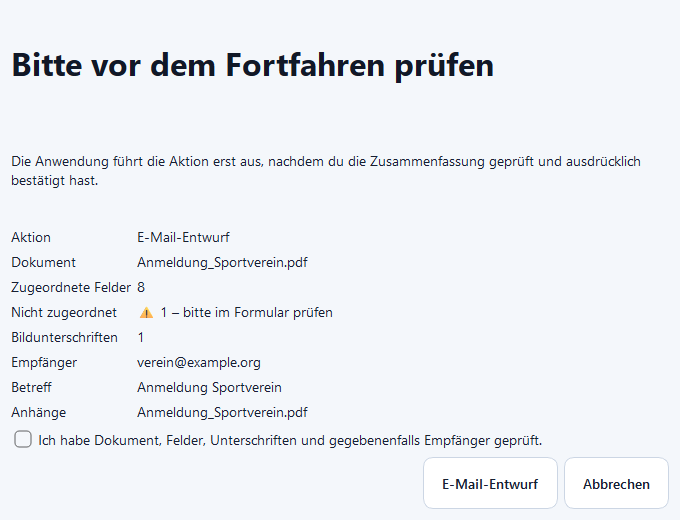

# Speichern, Drucken und E-Mail

## Speichern

Erstellt eine neue PDF-Arbeitskopie. Das Original bleibt unverändert.

## Drucken

Erstellt zunächst eine Arbeitskopie und übergibt sie nach Bestätigung an den
Windows-Standarddrucker.

## E-Mail-Entwurf

Empfänger und Betreff werden lokal aus Überschrift, Dateiname, Metadaten und
gefundenen E-Mail-Adressen vorgeschlagen. Es wird ausschließlich eine lokale
`.eml`-Datei erzeugt. Die Anwendung versendet keine Nachricht.

## Sicherheitsvorschau

Vor jeder Ausgabe werden Dokument, offene Felder, Bildunterschriften und bei
E-Mail zusätzlich Empfänger, Betreff und Anhang angezeigt. Die Aktion bleibt
gesperrt, bis die Prüfung ausdrücklich bestätigt wurde.

Verteilerlisten bleiben lokal. Bei mehreren Empfängern sind Datenschutz,
Einwilligung und eine geeignete Empfängeradressierung zu beachten.
